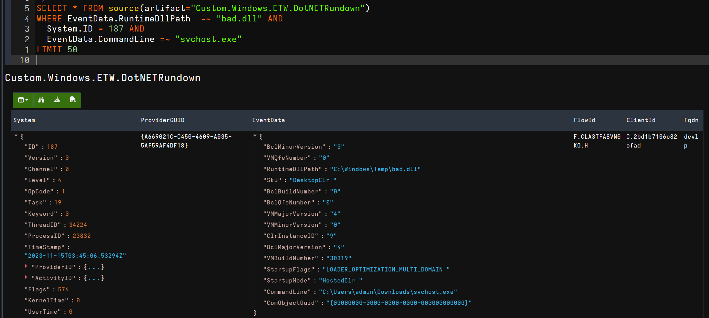
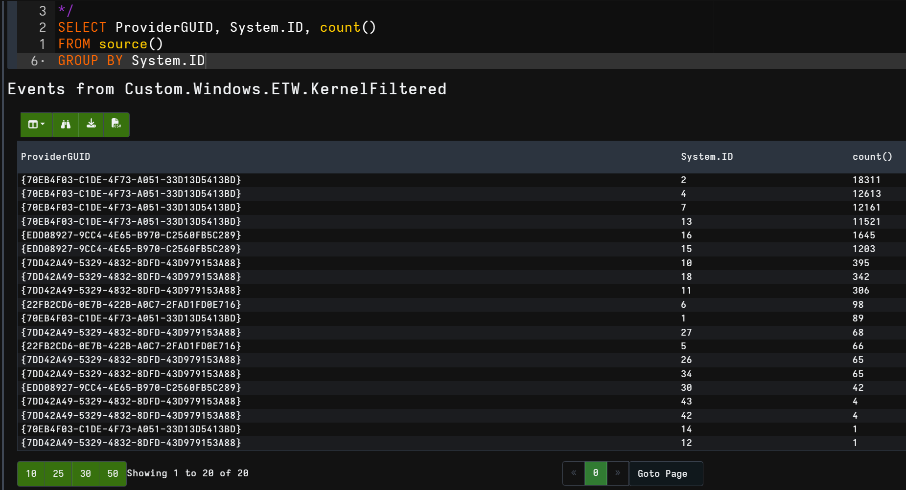

With the v0.7.1 release of Velociraptor, we have revamped how we access Event Tracing for Windows (ETW). Velociraptor can now:

- enable multiple providers under the same session
- customize how and when we close a provider
- enable Capture_State when subscribing to a provider
- disable post event processing, for faster speeds

`watch_etw` has four new optional arguments in v0.7.1:
- `stop`: this accepts a lambda expression to detail when the session should stop. 
- `timeout`: A period of seconds before the session will stop. 
- `capture_state`: a flag for whether the provider should have its state captured when subscribing to it. 
- `enable_map_info`: a flag for disabling API mapping of the events, which can greatly reluce overhead for highly verbose providers

Using these new arguments, it's now easier to use `watch_etw` in CLIENT artifacts, as well as CLIENT_EVENT artifacts. Disabling `enable_map_info` will prevent multiple API calls which help format the event, but in return will provide you much better performance for high volume providers.

Using the new `etw_sessios` plugin, Velociraptor now lists all ETW sessions on a device. 

```vql
SELECT * FROM etw_sessions()
```


In this blog, we're going to cover some of the new ways that you can use ETW to detect malicious activity on your network.

# About ETW

Event Tracing for Windows (ETW) is a low-level log exchange for User and Kernel log sources. Providers list themselves as an available log sources and feed their events into their provided channel. Consumers can create sessions to subscribe to these providers, receiving their messages in real time. Sessions can access the providers through the providers unique GUID.

Velociraptor can create ETW sessions through the `watch_etw` plugin. This plugin subscribes to a provided GUID, with the optional argument to provide a session name. If a session name is not provided, it will default to `Velociraptor`. In v0.7.1, Velociraptor can now subscribe to multiple plugins under the same session. This is most easily done through the plugin `chain`, using the `async` argument. 

```vql
SELECT * FROM chain(
   a={SELECT * FROM watch_etw(guid="{abcd}")},
   b={SELECT * FROM watch_etw(guid="{ef01}")},
   async=true
)
``` 


# Capture .NET state

.NET provides an easy and native way for malicious threat actors to reflectively load modules into memory. This is captured through two main ETW providers:

- Microsoft-Windows-DotNETRuntime
- Microsoft-Windows-DotNETRuntimeRundown

The first provider gives streaming updates of .NET modules as they happen, while the Rundown provider gives a snapshot of loaded modules at the time of execution. Rundown events will usually finish within 3 to 5 seconds, with the final event ID 146.

Using the new `stop` argument, we can create a lambda that exits when we receive event ID 146. Now that we have a stop command, we can create an artifact that queries a machines .NET Runtime state to find loaded .NET modules. In case something goes wrong, we can also use the `timeout` argument to ensure the session ends after a set amount of seconds. 

```vql
SELECT * FROM watch_etw(
   guid="{A669021C-C450-4609-A035-5AF59AF4DF18}",
   stop="x=>x.System.ID = 146"),
   timeout=60)
```

Running this artifact returns a snapshot of the current systems .NET runtime, including modules loaded, methods called and domains loaded. 



# Kernel event monitoring

There are multiple providers that provide insight into Kernel activities. This can give great streaming insight into the device, including process, file and network monitoring. 

Using the `chain` statement, we can create a single artifact which subscribes to multiple Kernel providers. Most Kernel providers have an extremely high volume of data, so bitmasks and filtering greatly reduces server overhead. For the Kernel providers, we provide the bitmasks:

- `0x50` - Microsoft-Windows-Kernel-Process: process and module events. 
- `0x1300` - Microsoft-Windows-Kernel-File: File read, write, and creation events
- `0xF707` - Microsoft-Windows-Kernel-Registry: Registry read, write, create and deletion events for keys and values. 

This gives us the following artifact:

```vql
SELECT * FROM chain(
   a={     
      SELECT *, 
      { SELECT * FROM pslist(pid=System.ProcessID) } as Process 
      FROM watch_etw(
         // Microsoft-Windows-Kernel-Process
         guid='{22FB2CD6-0E7B-422B-A0C7-2FAD1FD0E716}', 
         any=0x50, enable_map_info=false)
   }, b={  
      SELECT *,
      { SELECT * FROM pslist(pid=System.ProcessID) } as Process 
      FROM watch_etw(
         // Microsoft-Windows-Kernel-File
         guid='{EDD08927-9CC4-4E65-B970-C2560FB5C289}',
         any=0x1300, enable_map_info=false)
   }, c={  
      SELECT *,
      { SELECT * FROM pslist(pid=System.ProcessID) } as Process 
      FROM watch_etw(
         // Microsoft-Windows-Kernel-Registry
         guid='{70EB4F03-C1DE-4F73-A051-33D13D5413BD}', 
         any=0xF707, enable_map_info=false)
   }, d={             
      SELECT *,
      { SELECT * FROM pslist(pid=System.ProcessID) } as Process 
      FROM watch_etw(
         // Microsoft-Windows-Kernel-Network
         guid='{7DD42A49-5329-4832-8DFD-43D979153A88}', 
         enable_map_info=false)
   },async=true
)
```

We can then use notebooks on the collected data, hunting across streaming data. Initially we can query where the bulk of our data is coming from. Knowing how much data you can handle is essential when dealing with ETW. The following query was taken after a few minutes: 



Using this reference, we can see which events are producing the most events, and refine our bitmasks from there. Once happy, this provides streaming events of low level system events. 

# Wrap-Up

These improvements to `watch_etw` makes it easier for defenders to setup streaming detections for their network. For further hunting ideas using ETW, check out the follow blog by Nasreddine Bencherchali (@nas_bench        ):

[Finding Detection and Forensic Goodness In ETW Providers](https://nasbench.medium.com/finding-detection-and-forensic-goodness-in-etw-providers-7c7a2b5b5f4f)
